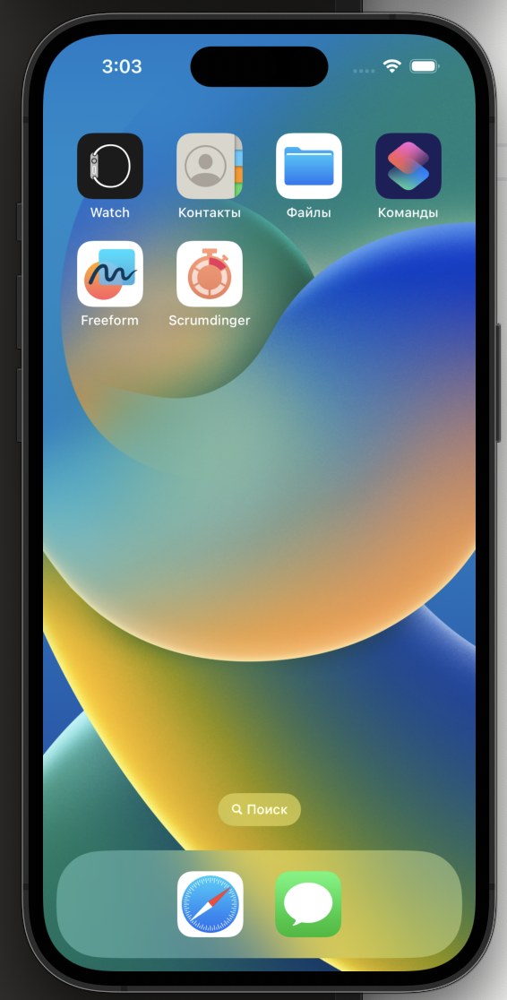

# Scrumdinger

В рамках изучения, используя туториалы App Dev, было создано приложение, используя SwiftUI для iOS.

<video width="320" height="240" controls>
  <source src="./screen/Scrumlist.mov" type="video/quicktime">
  Your browser does not support the video tag.
</video>

<video width="320" height="240" controls>
  <source src="./screen/Scrumtimer.mov" type="video/quicktime">
  Your browser does not support the video tag.
</video>
